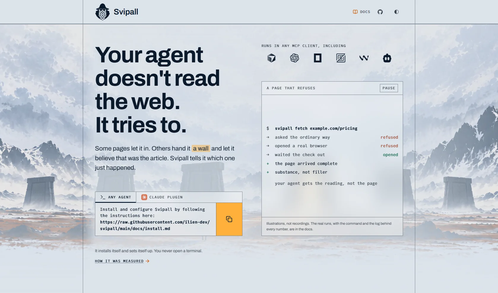

# svipall-site

The website for [Svipall](https://github.com/ilien-dev/svipall): a home page
that makes the case for it, and a docs section that explains how it works.



Svipall runs on your machine and gives your AI assistant the page, or the
reason it never arrived. No account, no key, nothing sent anywhere else.
This repository is only the site. The product lives in
[ilien-dev/svipall](https://github.com/ilien-dev/svipall).

## What's in it

- **`/`, the home.** One page that argues for the product: what goes wrong
  when an agent reads the web, what Svipall does about it, and how to install
  it. A film runs behind the hero, one per theme; under
  `prefers-reduced-motion` it is a still.
- **`/docs`, the docs.** Twelve pages (install, CLI, MCP tools, REST API,
  configuration, limits, privacy and more) with a sidebar, an on-this-page
  list and full-text search.

Astro 5, fully static. Vanilla CSS on custom properties, no CSS framework.
[Pagefind](https://pagefind.app) for search. Icons from
[lucide](https://lucide.dev) (ISC), inlined at build time.

## Run it

Node 22, which is what CI uses.

```bash
npm install
npm run dev        # http://localhost:4321
npm run build      # the static site into dist/, plus the search index
npm run preview    # serve that build
```

## Before you push

```bash
npm run verify
```

It builds the site, then runs the two gates CI runs on every push:

- `check:links`: every internal link and anchor in `dist/` resolves.
- `check:glyphs`: every icon name maps to an icon lucide actually ships. One
  that doesn't reaches the page as an empty box.

## Two rules

1. **The site may not claim anything the product does not do.** Every docs
   page names, in its front matter, the file in the product repo it was
   written from (`source: docs/install.md`). When the two disagree, the
   product repo is right.
2. **The accessibility floor is not negotiable.** Contrast (WCAG AA and APCA,
   both), visible focus, reduced motion, hit targets, line length. One item
   fails by the author's direction and is reported as failing rather than
   hidden: the client strip on the home can't be paused, and only stops for
   readers who ask their system for reduced motion.

## Where things are

| Path | What |
|---|---|
| `src/pages/index.astro` | The home |
| `src/components/` | The home's blocks. Each opens with a comment saying what it must never do. |
| `src/content/docs/` | The docs pages, in Markdown |
| `src/layouts/` | The page shells, `Base.astro` and `Docs.astro` |
| `src/styles/tokens.css` | Every raw value in the project: colour, type, spacing, the hero film |
| `src/lib/glyphs.ts` | The site's icon names, mapped to lucide's |
| `scripts/` | The two CI gates |
